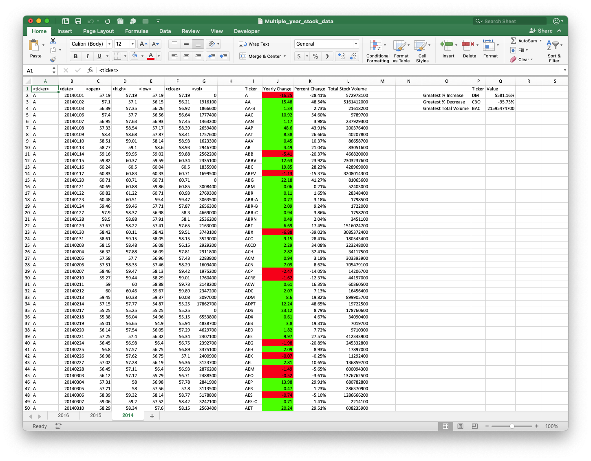
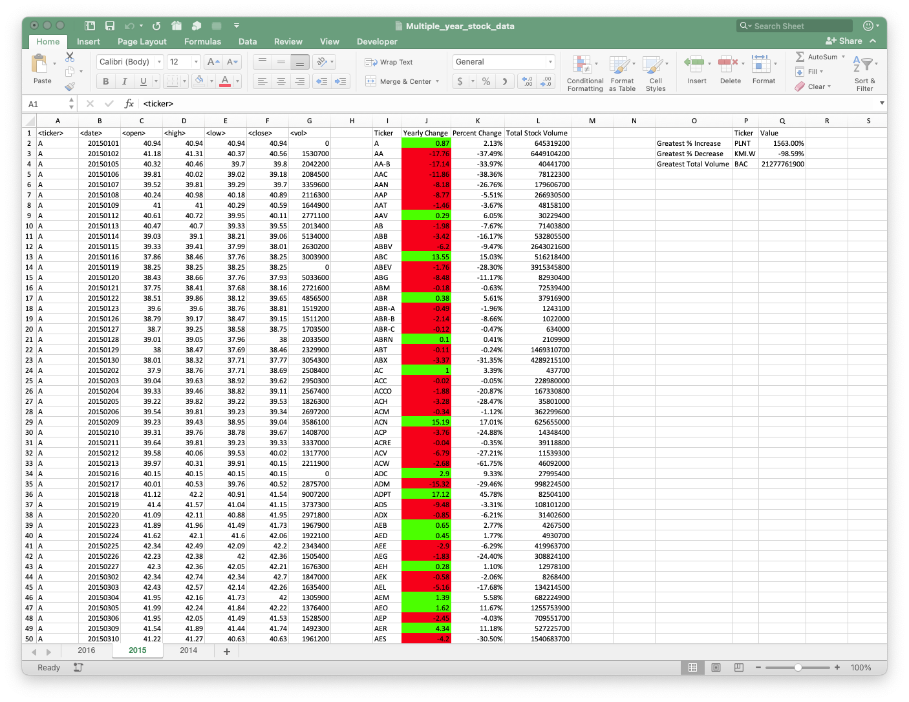
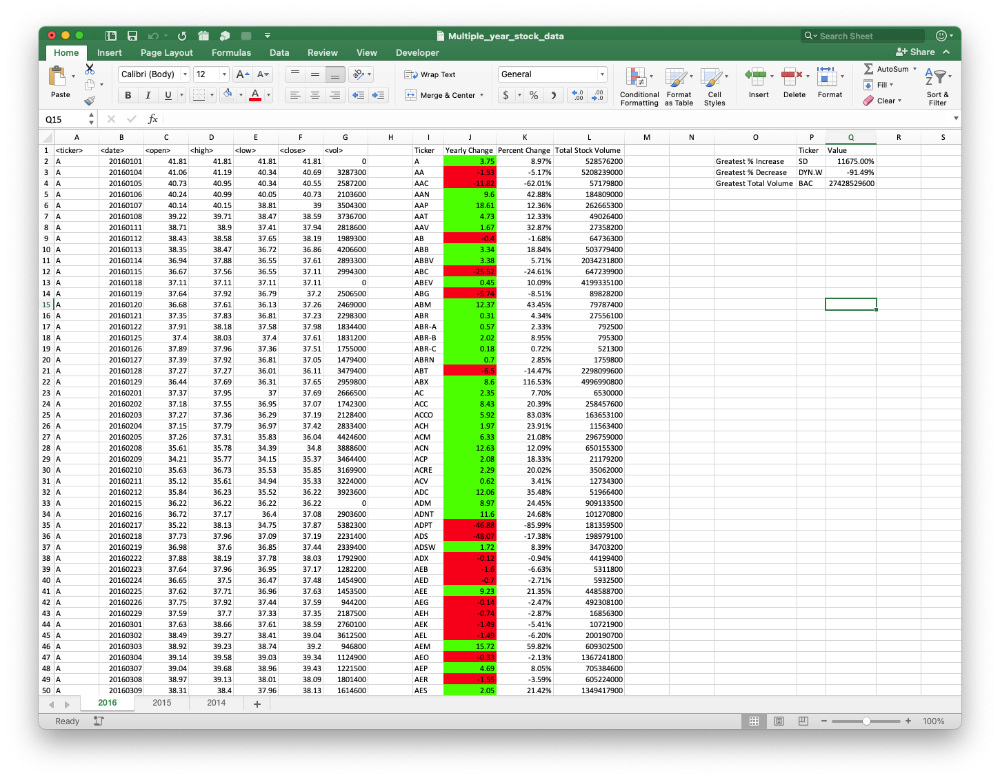

# VBA Homework - The VBA of Wall Street

## Background

You are well on your way to becoming a programmer and Excel master! In this homework assignment you will use VBA scripting to analyze real stock market data. Depending on your comfort level with VBA, you may choose to challenge yourself with a few of the challenge tasks.

### Files

* [Test Data] - Use this while developing your scripts.

* [Stock Data] - Run your scripts on this data to generate the final homework report.

### Stock market analyst

## Instructions

* Create a script that will loop through all the stocks for one year and output the following information.

  * The ticker symbol.

  * Yearly change from opening price at the beginning of a given year to the closing price at the end of that year.

  * The percent change from opening price at the beginning of a given year to the closing price at the end of that year.

  * The total stock volume of the stock.

* You should also have conditional formatting that will highlight positive change in green and negative change in red.

* The result should look as follows.

## BONUS

* Your solution will also be able to return the stock with the "Greatest % increase", "Greatest % decrease" and "Greatest total volume".

* Make the appropriate adjustments to your VBA script that will allow it to run on every worksheet, i.e., every year, just by running the VBA script once.

## Other Considerations

* Use the sheet `alphabetical_testing.xlsx` while developing your code. This data set is smaller and will allow you to test faster. Your code should run on this file in less than 3-5 minutes.

* Make sure that the script acts the same on each sheet. The joy of VBA is to take the tediousness out of repetitive task and run over and over again with a click of the button.

* Some assignments, like this one, contain a bonus. It is possible to achieve mastery on this assignment without completing the bonus. The bonus adds an opportunity to further develop you skills and be rewarded extra points for doing so.

## Results

* 2014 stock data after running the VBA script

* 2015 stock data after running the VBA script

* 2016 stock data after running the VBA script

- - -

### Copyright

Trilogy Education Services © 2020. All Rights Reserved.
